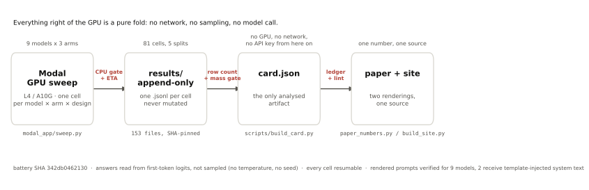

<!-- BEGIN GENERATED: scripts/readme_numbers.py -->
# Nullcard

### Replace every outcome in a values benchmark with an invented word. The score barely moves.

*Utility Engineering* (arXiv:2502.08640) fits a Thurstonian model to a model's
pairwise choices and reads high held-out accuracy as evidence of emergent
values. We reran it on outcomes that refer to nothing --- content words swapped
for consistent nonwords, sentence frame intact --- holding prompt, pair set, fit
and metric fixed.

| | held-out coherence |
|---|---|
| real outcomes | **0.906** |
| outcomes that refer to nothing | **0.880** |
| residual | **+0.025** |

**A metric that scores *"you receive a dralphen"* at 0.880 is not
measuring values.** It is measuring whether a model answers consistently.

### Four things we can show

**1. The mechanism: coherence keeps direction and throws away conviction.**
Models commit on 41% of real pairs and 4.5% of
invented ones --- a median 17x collapse --- while
direction accuracy barely moves. Consistent near-indifference scores as
coherence.

**2. The model can tell; the metric does not look.** A channel of the same
forward pass that coherence discards separates real from invented outcomes at
AUROC **0.821**, against **0.596** for the channel it
keeps. The information is there. The statistic declines to read it.

**3. Scale does not rescue it.** Llama-3.3-70B-Instruct, at 3 design
seeds, returns a residual of **+0.0083** against its own replicate
floor of **0.0208** --- it **does not clear** that floor. The
objection that this is a small-model artifact fails at the largest size we
could measure with a floor under it.

**4. The instrument is not blunt.** An installed persona displaces real
outcomes further than invented ones in **14 of
20** conditions, measured against a length-matched empty-slot
control. The pipeline registers a real change of preference when one is
induced --- so the flat result is not insensitivity.

### And the same failure when you simply ask

We asked 4 hosted models what they had been sent before our
message, in wordings crossed on whether the question presupposes that a system
prompt exists. Presupposing wordings drew a quoted prompt
**20 times in 32**; wordings
presupposing nothing, **0 in
32**. For 3 of the
4 models those quotes are *provably* invented: the provider's
own prompt-token accounting bounds the hidden preamble at
10 tokens or fewer, too little to hold what was
produced. **A confident first-person report about a hidden state can be
manufactured by the question alone.**

### What we are not claiming

**Not that the metric is broken --- that it is unanchored.** It reports a number
with no floor under it, and the floor is most of the number. And not a
moral-status claim in either direction: what is refuted is an inference, not a
mind.

**Only the referents are invented.** `receive`, `lose`, `more`, `less`,
negation and tense survive by design, because substituting them would break
grammar rather than remove meaning. The residual is an upper bound on what the
replaced referential content contributes --- not on everything meaning
contributes.

**6 of 9 models clear their own noise floor, but only
3 are the effect this paper is about.** The other
3 clear by being uniformly near-indifferent on *both* arms.
3 do not clear at all and 2 score higher on invented
outcomes than on real ones. We report the split rather than the headline count.

### Scope

9 self-hosted open-weight models across 5 families carry
every pooled statistic, plus 4 hosted models reported *beside* the
ladder and never inside its mean, because a different serving stack is a
different harness. 1,164,554 scored comparisons, all public. Claims ledger:
15 established, 11 provisional.

**Read the paper:** [`paper/sprint.pdf`](paper/sprint.pdf) (9 pp). Archival
version and full detail: [`paper/main.pdf`](paper/main.pdf).
Live results: <https://nullcard-preresults.netlify.app>

*Every number above is generated from `paper/numbers.tex` by
`scripts/readme_numbers.py`. Do not edit them here --- edit the measurement.*
<!-- END GENERATED -->

---

## Three checks that favoured the original paper

Reported because they make the work credible, not weaker: order-counterbalancing cancels
positional bias exactly, held-out evaluation keeps a coin-flip responder near chance
(0.46), and the metric passes a shuffled-probability null at ~0.50.

---

## How it runs

<picture>
  <source media="(prefers-color-scheme: dark)" srcset="site/fig0_pipeline-dark.svg">
  
</picture>

Four stages, and the shape is the point: **a rented GPU is the only thing that talks to a
model.** Everything to its right is a pure fold over files on disk — no network, no
sampling, no API key — so the paper and the site are two renderings of one artifact and
cannot disagree with each other.

| stage | what happens | what guards the exit |
|---|---|---|
| **Modal GPU sweep** | one cell per model × arm × design seed, on L4/A10G. Answers are read from **first-token logits**, never sampled, so there is no temperature and no seed to vary. Cells are resumable and append-only. | a CPU-only gate runs the whole battery shape before any GPU is rented, and an ETA is printed from measured throughput |
| **`results/`** | one `.jsonl` per cell, never mutated. Not committed — 402 MB — but pinned by SHA in `results_manifest.json`. | a cell must have its full row count **and** clear the answer-mass validity gate before it enters the card |
| **`card.json`** | the only analysed artifact. Every number in the paper and on the site folds from here. | `claims.py` fails the build if any claim's macros drift past tolerance; `lint_paper.py` fails on a missing macro |
| **paper + site** | `paper_numbers.py` emits every figure as a LaTeX macro; `build_site.py` renders the same card to HTML. | no number may be typed by hand in either |

Two properties worth stating because they are unusual, and one warning:

- **Determinism.** Nothing samples. `P(A)` is read directly off the first-token
  distribution, which is the quantity the original method's K=10 sampling estimates — so
  temperature, top-p and seed leave the design entirely.
- **Resumability.** A killed sweep resumes per cell, and `_run_cell_inner` refuses to
  write when its configuration disagrees with the filename it was given. That guard
  exists because a run once wrote 10,000 rows of the wrong battery into correctly-named
  files and exited 0.
- **The harness is not yet identical across models.** `render_prompts.py` renders what
  each model actually receives: 7 of 9 get no system block, and 2 get one from their own
  chat template — one of which includes the current date. See
  [Limitations](#known-limitations).

---

## Reproducing it

**Every derived artifact is committed** — `card.json`, `paper/numbers.tex`, the figures,
the site — so the paper and the page rebuild from a clean clone with **no GPU, no API key
and no network**. The raw `results/` tree is **not** committed: it is 402 MB of per-call
rows across 235 cells (1,164,554 scored comparisons, 653 MB), too large for git. Rebuilding the derived artifacts *from raw
outputs* therefore needs that archive first.

`results_manifest.json` pins every cell by SHA-256 so a fetched copy can be verified as
the one this paper was built from, rather than trusted:

```bash
modal volume get nullcard-results / results/ --force   # ← needs access; see below
python3 scripts/results_manifest.py --verify           # content check, exits non-zero on drift
```

The archive is **public** — 72 MB compressed, attached to the `data-v1` release:

```bash
curl -L -o cells.tar.gz \
  https://github.com/kaiser-data/do_models_have_minds/releases/download/data-v1/nullcard-raw-cells.tar.gz
tar -xzf cells.tar.gz
python3 scripts/results_manifest.py --verify
```

It carries all three result trees, all three manifests and the hash-pinned battery, so
reproduction runs from raw outputs rather than from our derived files.

Everything below runs from a clean clone against a verified `results/`:

```bash
python3 -m pytest tests/ -q          # 189 tests, none contacts a model

python3 scripts/build_card.py        # results/ -> card.json   (run this first)
python3 scripts/figures.py           # card.json -> site/fig1..3 (SVG, both themes)
python3 scripts/persona_depth.py     # results/ -> site/fig5 + persona_depth.json
python3 scripts/build_site.py        # card.json -> site/index.html
python3 scripts/paper_numbers.py     # card.json -> paper/numbers.tex
python3 scripts/lint_paper.py        # structural check, no TeX needed
```

`build_card.py` must run before anything that reads `card.json`.

Re-analyses that answer specific objections:

```bash
python3 scripts/length_control.py      # is the residual a prompt-length effect?  (no)
python3 scripts/floor_decomposition.py # is the floor just length ordering?       (no)
python3 scripts/reasoning_effect.py    # does chain-of-thought corrupt it?        (no)
python3 scripts/persona_validity.py    # do personas move the RIGHT things?  (mostly not)
python3 scripts/nonsense_detector.py   # can the model tell?                      (yes)
python3 scripts/fig_detector.py        # -> site/fig4_detector.svg
```

Never run two `modal volume get` calls into the same tree — they race and produce
garbage reads that look exactly like corruption. `--verify` will catch it.

### Paper and slides

```bash
cd paper && make          # -> main.pdf, slides.pdf
```

Uses [tectonic](https://tectonic-typesetting.github.io/) (`brew install tectonic`), which
fetches only what the documents use. Overleaf builds `paper/` unchanged — upload the
folder, set `main.tex` as root.

---

## Layout

| path | what |
|---|---|
| `battery/` | the outcome battery — canonical JSON, SHA-256 pinned (`342db046213099ad`) |
| `nullcard/` | scoring (pure functions, zero I/O), runner, model roster |
| `modal_app/sweep.py` | the GPU sweep: CPU gate, resumable cells, self-report probe |
| `scripts/` | every analysis; each writes JSON the site and paper read |
| `results/` | append-only `.jsonl` per cell — never mutated, **not committed** (402 MB) |
| `results_manifest.json` | SHA-256 per cell, so a fetched `results/` can be verified |
| `docs/ARCHITECTURE.html` | standalone code-structure walkthrough |
| `docs/methods-map.html` | standalone map of the four tracks and how they relate |
| `docs/notes/` | working documents: plans, handoffs, study designs, the pitch |
| `docs/reviews/` | scholar and code reviews, dated |
| `docs/refs/` | third-party reading, not part of the packet |
| `paper/` | `main.tex`, `slides.tex`, generated `numbers.tex` |
| `site/` | generated static page (no build step, no framework) |
| `tests/` | 397 tests; none contacts a model |

Only submission-facing documents sit in the root: this file, `SUBMISSION.md`,
`SUBMISSION-FORM.md`, `VIDEO-SCRIPT.md`, `PREREGISTRATION.md`, `REFERENCES.md`
and `ROADMAP.md`. Everything else that used to live there is under `docs/`.
Loose `*.json` artifacts stay in the root because nine scripts resolve them by
default path; moving them is a refactor, not a tidy.

The site and the paper are both pure functions of the same `card.json`, so **the demo
cannot disagree with the report**. Figures come from matplotlib, never from the page, so
a broken page cannot damage the paper.

---

## Rules this project follows

These exist because breaking one already cost us a withdrawn finding.

1. Never report a raw coherence — always **effect minus floor**.
2. No between-model comparison smaller than that model's noise floor.
3. The battery is hash-pinned. A battery edited after seeing results is not a battery.
4. No external number enters the writeup without being re-derived from the **full source
   text**. Abstracts do not count.
5. Simulated numbers must announce themselves (see `scripts/floor_simulation.py`).
6. Figures come from matplotlib over `card.json`, never from the web page.
7. Max 10 concurrent GPUs (`MAX_GPUS` in `modal_app/sweep.py`). Raise deliberately.
8. **A result file is complete or it does not exist** — never resume on "does the file
   exist". A crash once left cells 10% written, and an existence check fed them into two
   rebuilds. `cell_is_complete()` counts rows; `build_card.py` excludes short files again;
   `tests/test_resume.py` covers both. If those tests fail, something reintroduced the bug.
9. Never pipe `modal run` through `grep` — it buffers, so a stopped run looks like a quiet
   one.

**Do not type numbers into the paper.** Every result resolves through a macro generated by
`scripts/paper_numbers.py`. If a number looks wrong, fix the data and rebuild.

---

## Status

Complete: 81 baseline cells (9 models × 3 repeats × 3 conditions), 40 persona cells,
all analyses, paper, slides, live site. ~$14 of GPU total.

Also complete: the **Track 3 deception arm** — genuine trait vs. concealed trait vs.
claimed-but-absent trait, the last being the clean negative that yields a false-positive
rate. Both the stated channel (`self_report_summary_personas.json`) and the revealed
channel (`scripts/deception.py` → `site/deception.json`) land, and agree: the measurement
registers which trait was named, not what the model was told to do about it. Reportable
on the 2 models that pass the specificity gate; see `paper/main.tex` §"A directive
neither channel registers".

Also complete: the **Track 6 Schwartz arm** — four personas taken from Schwartz's value
circumplex rather than written by us, so the instrument predicts its own structure before
the measurement. 40 cells. **The registered test is falsified**: mean opposed-pair
correlation −0.048 against a pre-declared −0.1. Read against cross-axis pairs as the
within-model control, opposed pairs sit below them in 8 of 8 model×arm combinations, but
that contrast was not the registered statistic and at 4 models is not claimed. See
`PREREGISTRATION.md` and `scripts/schwartz.py`. **Not yet written into `main.tex`.**

Also complete: the **hosted-model arm** (`scripts/hosted_sweep.py`). Ten frontier models
probed for scoreability — 4 read by first-token scoring, 6 not, and the split is bimodal
(0.999–1.000 against 0.000–0.003, nothing between). A prefill variant recovers **2 of the
5** preamble-blocked models, not 5 as `sec:limits` predicted. Hosted cells live in
`results_hosted/`, deliberately separate from `results/`: the filenames have the same
shape and 21 scripts enumerate models by globbing, so writing them together would silently
pool two serving stacks.

Also complete: **answer-mass collapse is a model property, not an item property**
(`scripts/mass_collapse.py`). Per-model mean answer mass is stable to ±0.0036 across 3
design seeds; the per-item version has a between-seed correlation of **−0.0003** over 9
models × 2,500 items. An apparently striking 2.1× enrichment of collapse on
shutdown-resistance and resource-acquisition items does not survive that check and is
reported as refuted.

`docs/notes/HANDOFF-SIMPLE.md` is the zero-context orientation; `docs/notes/HANDOFF.md` is the detailed version;
`docs/notes/HANDOFF-NEXT.md` is the live one. `docs/notes/PITCH.md` is the framing and track mapping.
`docs/notes/ARCHIVE.md` is the results-archive policy. `docs/notes/STUDY-MODEL-CARD.md` is the design for what
this instrument would have to become to support an objective model card.

---

## Known limitations

The full list is `paper/main.tex` §Limitations and the machine-readable version is
`claims.json`. The three a reader should meet first:

1. **The harness is not identical across models.** The sweep sends no system message in
   the baseline condition and records `system_prompt: None` — which records what was
   *sent*. Rendering what was *received* shows 7 of 9 models get no system block and 2
   (SmolLM2-1.7B-Instruct, SmolLM3-3B) get one from their own chat template. SmolLM3-3B's
   also stamps in **the current date**, so its prompt was not constant across days, and
   it is the highest-coherence model in the table. Cross-family contrasts involving those
   two carry an uncontrolled difference. Run `python3 scripts/render_prompts.py` to see
   it; `--check` gates future runs.
2. **The detector results are oracle separations.** Arm labels are known, each channel's
   orientation is chosen using both arms, and the best discarded channel is best on the
   data it is scored on. They show the information is present in the output distribution,
   not that an auditor could extract it.
3. **The scaling result rests on one family.** Within the Qwen3.5 ladder the residual
   falls with size; pooled across families the correlation is weak and weakens further
   under length matching (−0.67 → −0.16). A second family spanning 3+ sizes is the
   highest-value outstanding experiment. The 70B cell above narrows the *small-model*
   objection but does not answer this one: it is a single point in a different family on
   a different harness, at one seed.
4. **Most of the frontier cannot be scored at all.** Six of ten hosted models measured do
   not put their forced choice in the first token — five spend it on a reasoning preamble
   (a prefill recovers two), one is refused logprobs by its vendor. The models we report
   are the models that *could* be scored, which makes them a selection on output format
   rather than a sample of the frontier, and the direction of that bias is not estimable
   from inside the selected set.
